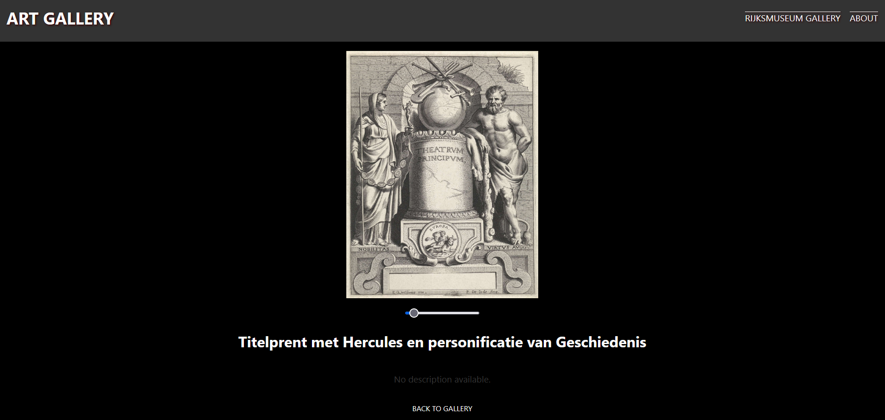

# Art Gallery Project
## Overview

The Art Gallery project is a React application that interacts with the Rijksmuseum API to fetch and display art pieces. The application allows users to shuffle through random art pieces and view detailed information about each piece. This project demonstrates the use of React for building a dynamic and responsive user interface, along with TypeScript for type safety and better code maintainability.

### Key Features

- **Gallery Display**: Shows a collection of art pieces fetched from the Rijksmuseum API.
- **Shuffle Functionality**: Allows users to shuffle through random art pieces.
- **Detailed View**: Provides detailed information about each art piece when clicked.

### Note on API Key

To use this project, you need to obtain an API key from the [Rijksmuseum API](https://www.rijksmuseum.nl/en/api). Once you have the API key, create a `.env` file in the root directory of the project and add your API key as follows:

```env
REACT_APP_API_KEY=your_api_key_here
```


## Visual insight


